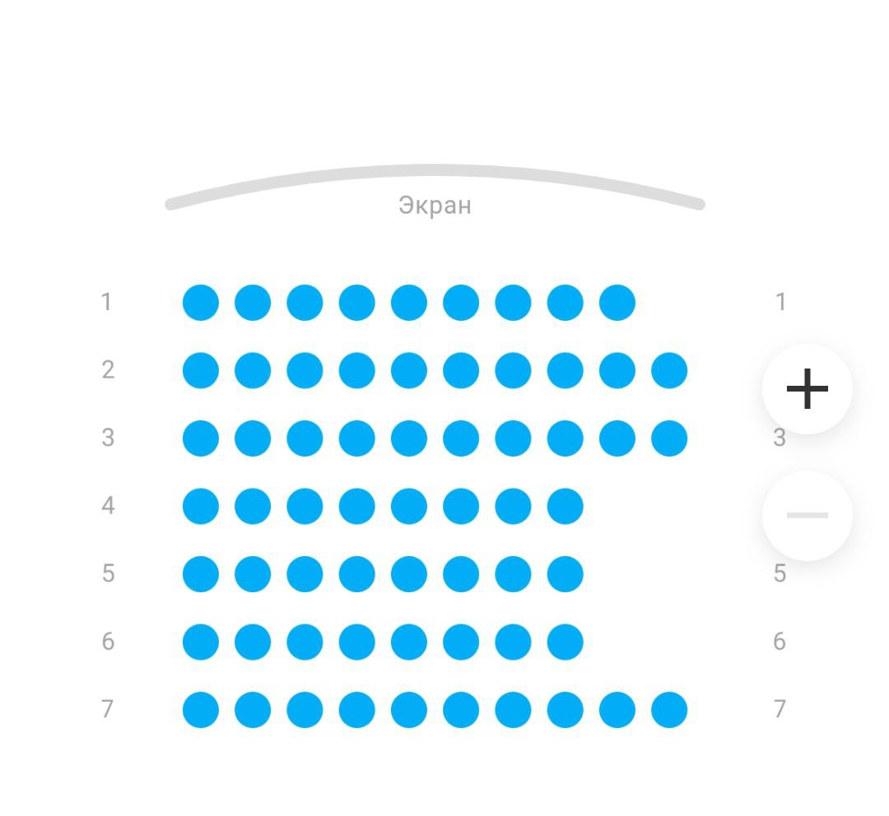

 
	
 
		<h2 id= "header__title"> Movie Seat Booking </h2>
	

 
	

		<h3 id="residential-complex__title">Функционал выбора мест в кино</h3>
	

	
 
	<h4>Идея для проекта взята с сайта "Яндекс Афиша" </h4>
	 
	

	

		<h4>Результат и что используется:</h4>
		<ol id="residential-complex__list">
			<li id="residential-complex__item">
			 Результат - <a href="https://kindneko.github.io/Form-Validation/" target="_blank">ссылка на готовый проект</a> 
			</li>
			<li id="residential-complex__item">
			 html, css, js
			</li>
		</ol>
	

